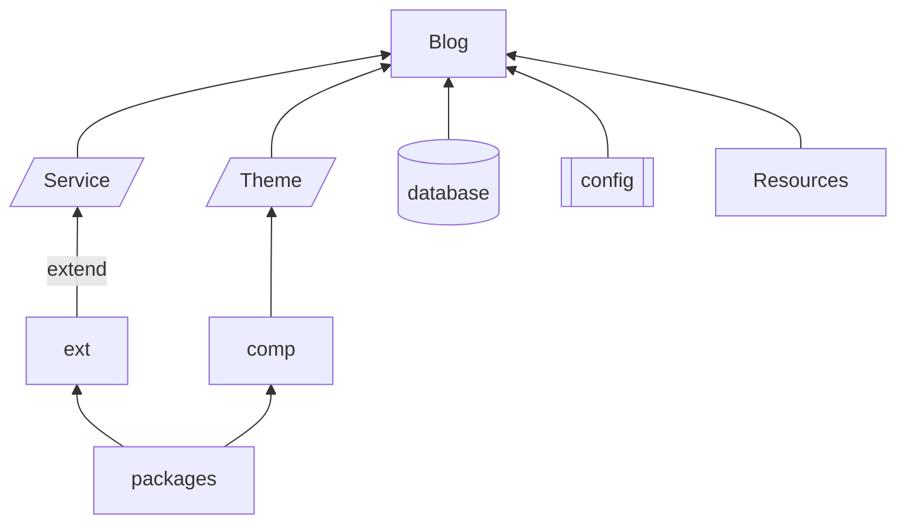

# Design

fast, smart, flexible blog system for professional.

## structure

1. `package`: similar to python packages, newly implemented functions, follow *package design guidebook*
2. `comp`: used for theme template, can import `package`, implement components for front-end, style must be flexible, follow *component design guidebook*
3. `ext`: used for extend functions for system services, can import `package`, implement components for back-end, follow *service design guidebook*
4. `theme`: theme template, follow *theme design guidebook*
5. `service`: contain naive system services, check more details below

#### folder structure

Prolog System:

1. `kernel`: kernel for the blog system
   1. `engine`: blog interaction implements
   2. `DBO`: low level database objects
   3. `service`: the naive service provided
   4. `routers`: routers folder
2. `exts`: extensions for service.
   1. `sample_ext`: this is a sample `ext`
3. `theme`: the theme template used for this blog
4. `res`: resources folder, contain all medias or valid files
5. `packages`: packages folder.
   1. `sample_package`: this is a sample `package`
6. `cache`: cache folder, write access for all packages
7. `config.ini`: initialize file for blog
8. `database.db`: database driven by SqLite

## feature

1. all operation can be done in python locally or remotely.
2. only one user and user group: `admin`, can only be newed in system initialization process. don't support register new user or delete.
3. provide a powerful API, make it easier to interact remotely via python.
4. robust document and support for developing theme or plug-in
5. all in one, easily migration or creating backup.
6. fast: no fancy stuffs, maximize cache usage, born for speed.
7. highly flexible, you can even modified the naive function if you wish.

## router

**/sys/:** parent router contain function include system level operation, like initialize system, system configure modification, database io.

**/auth/:** all authorization operation, like login, logout, registration.

**/blog/:** operations on blog create, delete, change...

**/res/:** resources router, only way to get medias

## service

naive and default services

`TODO`

## guidebook

what you should read before contributing.

### package

`TODO`

### ext

`TODO`

### theme 

`TODO`
